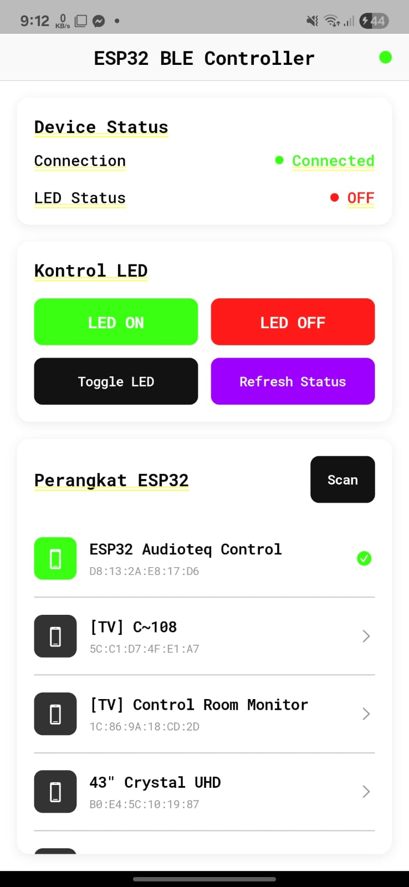

# Flutter BLE ESP32 Controller

Aplikasi Flutter untuk mengontrol ESP32 melalui Bluetooth Low Energy (BLE). Aplikasi ini memungkinkan Anda untuk terhubung ke ESP32 dan mengontrol LED secara wireless.

<div align="center">
  
</div>

## 🚀 Fitur

- **Scanning & Discovery**: Otomatis mencari dan menampilkan perangkat ESP32 di sekitar
- **Koneksi BLE**: Terhubung ke ESP32 menggunakan Bluetooth Low Energy
- **Kontrol LED**: Menyalakan dan mematikan LED pada ESP32
- **Real-time Status**: Monitoring status LED secara real-time
- **Permission Management**: Otomatis mengelola izin Bluetooth yang diperlukan
- **Cross Platform**: Mendukung Android dan iOS

## 📋 Prasyarat

- Flutter SDK (>=3.4.1)
- Android Studio / VS Code
- ESP32 dengan kode Arduino yang kompatibel
- Android device dengan Bluetooth LE support (API level 21+)
- iOS device dengan Bluetooth LE support (iOS 10+)

## 🔧 Konfigurasi ESP32

**PENTING**: Sebelum menggunakan aplikasi ini, pastikan ESP32 Anda sudah dikonfigurasi dengan benar.

### UUID Configuration

Aplikasi ini menggunakan UUID khusus untuk komunikasi dengan ESP32. Pastikan kode Arduino ESP32 Anda menggunakan UUID yang sama:

```cpp
// Service UUID - harus sama dengan serviceUUID di BLEConstants
#define SERVICE_UUID        "4fafc201-1fb5-459e-8fcc-c5c9c331914b"

// Characteristic UUID - harus sama dengan ledCharacteristicUUID di BLEConstants
#define CHARACTERISTIC_UUID "beb5483e-36e1-4688-b7f5-ea07361b26a8"
```

### 📁 Lokasi Kode Arduino

Kode program untuk ESP32 tersedia di file berikut:

arduino/esp32-sketch.ino

Buka file tersebut dengan Arduino IDE, kemudian upload ke ESP32 seperti biasa.

#### Cara Upload:

1. Buka `arduino/esp32-sketch.ino` di Arduino IDE
2. Pilih board: `ESP32 Dev Module` (atau board sesuai yang Anda gunakan)
3. Hubungkan ESP32 ke komputer via USB
4. Klik tombol **Upload**


### Mengubah UUID (Opsional)

Jika Anda ingin menggunakan UUID yang berbeda:

1. **Update kode Arduino ESP32** dengan UUID baru
2. **Update file Flutter** `lib/constants/ble_constants.dart`:

```dart
// Ganti dengan UUID dari kode Arduino ESP32 Anda
static const String serviceUUID = "YOUR_SERVICE_UUID_HERE";
static const String ledCharacteristicUUID = "YOUR_CHARACTERISTIC_UUID_HERE";
```

### Nama Device

Secara default, aplikasi mencari perangkat dengan nama:

- "ESP32 Audioteq Control"
- "ESP32_Audioteq"
- "Audioteq_ESP32"

Untuk mengubah nama yang dicari, edit `alternativeDeviceNames` di `lib/constants/ble_constants.dart`.

## 📱 Instalasi

1. **Clone repository**:

```bash
git clone <repository-url>
cd flutter_ble_esp32
```

2. **Install dependencies**:

```bash
flutter pub get
```

3. **Konfigurasi platform**:

### Android

- Minimum SDK: 21
- Target SDK: 34
- Permissions sudah dikonfigurasi di `android/app/src/main/AndroidManifest.xml`

### iOS

- Minimum iOS: 10.0
- Bluetooth permissions sudah dikonfigurasi di `ios/Runner/Info.plist`

4. **Run aplikasi**:

```bash
flutter run
```

## 🎯 Cara Penggunaan

1. **Persiapan**:

   - Pastikan ESP32 sudah running dengan kode yang kompatibel
   - Pastikan ESP32 dalam keadaan hidup
   - Aktifkan Bluetooth di device Android/iOS
   - Berikan izin Bluetooth saat diminta

2. **Koneksi**:

   - Buka aplikasi
   - Tap tombol "Scan" untuk mencari ESP32
   - Pilih ESP32 dari daftar perangkat
   - Tunggu hingga status "Connected"

3. **Kontrol LED**:
   - Gunakan tombol "LED ON" untuk menyalakan LED
   - Gunakan tombol "LED OFF" untuk mematikan LED
   - Status LED akan ditampilkan secara real-time

## ⚙️ Konfigurasi Lanjutan

### Timeout Settings

Edit di `lib/constants/ble_constants.dart`:

```dart
static const Duration connectionTimeout = Duration(seconds: 30);
static const Duration scanTimeout = Duration(seconds: 15);
static const Duration operationTimeout = Duration(seconds: 10);
```

### Protocol Communication

Aplikasi menggunakan protocol sederhana:

- `[1]` = LED ON
- `[0]` = LED OFF
- `[255]` = Request status

## 🔍 Troubleshooting

### Perangkat tidak ditemukan

- Pastikan ESP32 dalam mode advertising
- Cek nama device di kode Arduino sesuai dengan `alternativeDeviceNames`
- Pastikan jarak tidak terlalu jauh (< 10 meter)

### Gagal terhubung

- Restart ESP32
- Restart Bluetooth di device
- Cek UUID di kode Arduino sama dengan `BLEConstants`

### Permission denied

- Buka Settings > Apps > [App Name] > Permissions
- Aktifkan semua permission Bluetooth

## 📦 Dependencies

- `flutter_blue_plus: ^1.32.2` - BLE communication
- `permission_handler: ^11.3.1` - Permission management
- `google_fonts: ^6.1.0` - Typography
- `app_settings: ^5.1.1` - Settings navigation

## 🤝 Contributing

1. Fork repository
2. Create feature branch (`git checkout -b feature/AmazingFeature`)
3. Commit changes (`git commit -m 'Add some AmazingFeature'`)
4. Push to branch (`git push origin feature/AmazingFeature`)
5. Open Pull Request

## 📄 License

Distributed under the MIT License. See `LICENSE` for more information.

## 📞 Support

Jika mengalami masalah:

1. Cek bagian Troubleshooting di atas
2. Pastikan konfigurasi UUID sudah benar
3. Buat issue di repository ini dengan detail error

---

**⚠️ Catatan Penting**: Pastikan UUID di kode Arduino ESP32 sama persis dengan yang ada di `lib/constants/ble_constants.dart` agar komunikasi BLE dapat berfungsi dengan baik.
